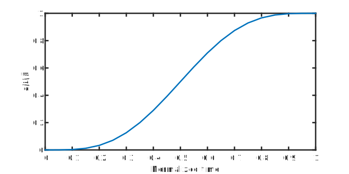
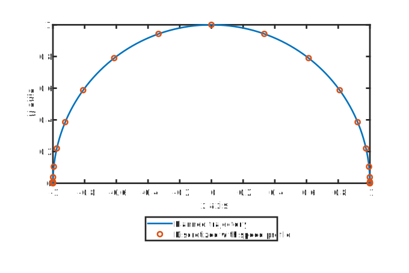

---
title: 'Guide: Get the Franka Emika Panda running with C++'
author: Christoph Hinze
date: \today
institute: IRTG Soft Tissue Robotics (GRK2198/1)
...

# Preliminaries:

1. The tutorial will run on Linux, explanations below are for Ubuntu. If you haven't already installed Ubuntu on your Computer, or enabled the Windows Sybsystem on Linux (WSL), you should install it, following the tutorial on <https://docs.microsoft.com/en-us/windows/wsl/install-win10>. As distribution install e.g. Ubuntu 18.04. This will enable you to run a virtual Ubuntu terminal on Windows 10.
2. Install Git on Windows (<https://docs.microsoft.com/en-us/windows/wsl/install-win10>), or directly in the WSL (`sudo apt install git`)
3. Install requirements for building the C++ project that we will create throughout this tutorial.  We need `libfranka` (unfortunately not directly available through sources) and `libeigen3-dev`

    ```sh
    mkdir -p ~/dev && cd ~/dev
    libfranka_version="0.6.0"

    # install Eigen3 and libfranka 
    sudo apt update && sudo apt install --yes build-essential cmake git libpoco-dev libeigen3-dev

    # from here: build libfranka dependency from source code and install it:
    git clone https://github.com/frankaemika/libfranka.git
    cd libfranka

    git checkout ${libfranka_version}
    git submodule update

    mkdir build && cd build
    cmake -DCMAKE_BUILD_TYPE=Release -DBUILD_TESTS=OFF -DBUILD_EXAMPLES=OFF ..
    make -j4
    sudo make install
    ```
4. A manual on the Franka Emika Panda and `libfranka` is at <https://frankaemika.github.io/docs/getting_started.html>
5. A documentation for `libfranka` can be found at <https://frankaemika.github.io/libfranka/>
6. We will use `Eigen3` as math library, where an introduction may be found at <http://eigen.tuxfamily.org/dox/group__QuickRefPage.html>


# Theory

## How the path planning is done:

The overall trajectory is described by a path $\bm p(t): \mathbb R \mapsto \mathbb R^3$. We decouple the spatial planning from the time coordinate, by splitting it into the path itself, which is parametrized by its arc length with a length coordinate $s$ as

$$ \bm p(s) \in \mathbb R^3, \quad s \in [0,L].$$

In a separate step a motion profile is used to generate a smooth mapping $s(t): \mathbb R \mapsto \mathbb R$, connecting the arc length with a time coordinate.

Finally, by inserting the motion profile into the path, we get

$$ \bm p(t) = \bm p(s(t)) \in \mathbb R^3 $$


{#fig:speedProfile}

{#fig:sampleTrajectory}

The principle is visualized in {@fig:sampleTrajectory}, where a desired 2D trajectory $p(s)$ is shown. The speed Profile $s(t)$, pictured on {@fig:speedProfile}, is used to map the path location $s$ to a specific time $t$ and obtain the desired trajectory at discrete time points (i.e. $p(s(t))$, where $t \in 0(h)t_E$ with discretization step width $h$ and motion end time $t_E$).

### Motion Profile

We use a polynomial reference trajectory $s(t)$ (see {@fig:speedProfile}), assuming no motion at begin and end of the trajectory (i.e. $\dot s(t=\{0, t_E\}) = 0$, $\ddot s(t=\{0, t_E\}) = 0$, ... ). We require the motion profile to be 3 times (velocity, acceleration, jerk) continuously differentiable on $t\in [0, t_E]$ (in fact, a bijective mapping). This leads to a polynomial of order $N = 2*3+1 = 7$. We get (normalized for $s \in [0,1], t\in [0,t_E]$):

$$s(t) = L \sum_{k=4}^7 a_k \left(t/t_E\right)^k = \bm a^T \underbrace{\bm{\bar t}}_{\frac{1}{t_E^k}\begin{bmatrix}t^4\\t^5\\t^6\\t^7 \end{bmatrix}}, \quad\text{with } \bm a = \begin{bmatrix} 35 &  -84 & 70 & -20 \end{bmatrix}^T$$
$$\dot s(t) =  L\sum_{k=4}^7 k a_k t^{k-1}/t_E^k, \quad \ddot s(t) = L\sum_{k=4}^7 k (k-1) a_k t^{k-2}/t_E^k, \quad \ldots$$

To assure, that dynamical limits are kept in Cartesian space, i.e. $\| \bm {\dot p}(t)\| \leq \bm v_{\max}$ and $\| \bm{\ddot p}(t) \|\leq \bm a_{\max}$, the motion profile needs to be transformed. Note, that $\bm p(s)$ is parametrized by arc length, which yields $\|\bm p'(s)\| \equiv 1$. With the cuve derivatives $\bm p'(s), \bm p''(s)$, etc. known, we can express

$$\underbrace{\|\bm p'(s(t))\|}_{=1} \|\dot s(t)\| \leq \bm v_{\max}, \quad t \in [0, t_E] $$
$$\Leftrightarrow \|\dot s(t)\| \leq v_{\max}$$

Solving $\ddot s = 0$ yields the velocity maximum at $t_{\max,v} = t_E/2$, where $\dot s(t_{\max,v}) = \frac{35 L}{16 t_E}$. We get the constraint, that 

$$ t_E \geq \frac{35 L}{16 v_{\max}}.$$

Similarly, for $\ddot s(t)$ we get maxima at $t_{\max,a} = (5 \pm t_E \sqrt 5)/10$, which both yield $\ddot s(t_{\max,a}) \approx_5\mp 0.72143 L/t_E^2$. Hence, the second constraint is

$$ t_E \geq \sqrt{ 7.51319 L /a_{\max}}. $$

By combining both constraints, we can give the end time $t_E$ as

$$ t_E = \max\{35 L/(16 v_{\max}), \sqrt{7.51319 L /a_{\max}} \} .$$

# Exercises:

## Tutorial Project

get the tutorial from github with

```sh
cd ~/dev
git clone https://github.com/chhinze/panda_tutorial
```

## Ex. 1: Build the demo project and its documentation

## Ex. 2: Math operations with `Eigen3`

## Ex. 3: Drive the robot on axes level

## Ex. 4: Drive the robot in a linear trajectory